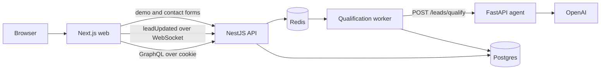
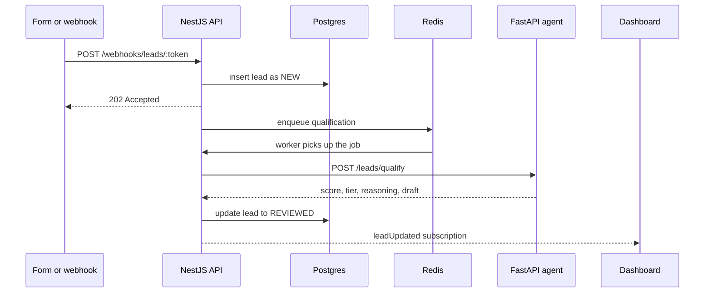

# Sift

Sift is a multi-tenant SaaS app that qualifies inbound sales leads with an AI agent. Each workspace sets its own criteria. When a lead arrives, the agent scores it, assigns a tier (HOT, WARM, or COLD), writes the reasoning, and drafts a reply. The dashboard updates live.

The local loop is demoable: sign up, save criteria, copy a webhook, post a lead, and watch it move from new to reviewed.

## Architecture

Three apps share Postgres and Redis.

| Piece | Role | Local URL |
|---|---|---|
| `web/` | Next.js landing page, signup/login, and dashboard | http://localhost:3000 |
| `api/` | NestJS GraphQL API, auth, Prisma, webhook, BullMQ worker | http://localhost:3001 |
| `agent-service/` | FastAPI scoring service (OpenAI, optional Clearbit) | http://localhost:8000 |
| Postgres | Organizations, users, leads | localhost:5432 |
| Redis | BullMQ queue and `leadUpdated` pub/sub | localhost:6379 |



### What each service owns

**Web.** Landing page, auth screens, and the dashboard (inbox, criteria, integrations). The browser talks to the API with an httpOnly `sift_token` cookie. Public demo and contact forms post to a Next.js route, `/api/demo-lead`, which forwards the body to `DEMO_WEBHOOK_URL` on the server so the webhook token never reaches the browser.

**API.** GraphQL for signup, login, workspace criteria, leads, and the integrations webhook URL. A public REST route, `POST /webhooks/leads/:token`, accepts a lead, saves it as `NEW`, and returns `202`. A BullMQ worker then loads that workspace's criteria, calls the agent, writes score, tier, reasoning, and draft reply, and marks the lead `REVIEWED`. Redis pub/sub pushes `leadUpdated` to open dashboards over `graphql-ws`.

**Agent.** `POST /leads/qualify` scores one lead against the criteria it is given. `POST /leads/qualify/stream` does the same and streams the reasoning as server-sent events. Clearbit enrichment runs only when `ENRICHMENT_API_KEY` is set. Docs: http://localhost:8000/docs.

### Lead path



Auth is a separate path. Signup and login set `sift_token`. On localhost the cookie is `SameSite=Lax`. In production it is `SameSite=None; Secure`, because the dashboard and API are on different hosts. CORS allows only `WEB_APP_URL` and sends credentials.

### Data model

One `Organization` is a workspace. It holds the qualification criteria, product description, reply tone, and a unique `webhookToken`. `User` rows belong to one org. `Lead` rows belong to one org and start as `NEW`; after the worker finishes they are `REVIEWED` with a score, tier, reasoning, and draft reply.

## How to run

### Prerequisites

- Node.js 22+ and npm
- Python 3.12+ and [uv](https://docs.astral.sh/uv/)
- Docker, or Postgres and Redis already running locally
- An OpenAI API key

### 1. Postgres and Redis

```bash
docker compose up -d
```

That starts Postgres 16 (`user` / `password`, database `sift`) on port 5432 and Redis on port 6379. Those match `api/.env.example`.

If you already have Postgres, create a database and set `DATABASE_URL` in `api/.env` to it. Redis only needs to be reachable at `REDIS_URL`.

### 2. Environment

```bash
cp api/.env.example api/.env
cp agent-service/.env.example agent-service/.env
cp web/.env.example web/.env
```

Fill in `OPENAI_API_KEY` in `agent-service/.env`. Set `JWT_SECRET` in `api/.env` to any long random string. Leave the localhost URLs as they are.

`DEMO_WEBHOOK_URL` in `web/.env` is optional until you want the public forms to land in a real workspace. After you sign up, copy the webhook from **Integrations** and paste it there, then restart `make dev` so Next.js reloads it.

### 3. Install and migrate

```bash
make install
cd api && npx prisma migrate dev
```

### 4. Start everything

```bash
make dev
```

That runs the agent on port 8000, the API on port 3001, and the web app on port 3000. Postgres and Redis must already be up. Stop it with Ctrl+C.

| URL | What it is |
|---|---|
| http://localhost:3000 | Landing page and dashboard |
| http://localhost:3001/graphql | GraphQL (GraphiQL in development) |
| http://localhost:3001/health | API health |
| http://localhost:8000/docs | Agent OpenAPI docs |
| http://localhost:8000/health | Agent health |

### 5. Demo the scoring loop

1. Open http://localhost:3000 and create an account.
2. On the dashboard, save qualification criteria.
3. Open **Integrations** and copy the webhook URL.
4. Post a lead:

```bash
curl -X POST "$WEBHOOK_URL" \
  -H 'content-type: application/json' \
  -d '{"fullName":"Maya Chen","email":"maya@northwind.io","companyName":"Northwind","message":"150 person team, $50k budget"}'
```

5. Refresh **Leads**. The row appears as new, then moves to reviewed with a score, tier, reasoning, and draft once the agent responds.

The landing page **Try it** form and the contact form use the same webhook when `DEMO_WEBHOOK_URL` is set.

### Email inbox

With a Gmail app password, Sift can take leads from mail that mailbox receives and send the draft reply back to the sender.

In `api/.env`:

```bash
GMAIL_USER=you@gmail.com
GMAIL_APP_PASSWORD=your-app-password
INBOUND_EMAIL_TOKEN=the-token-from-Integrations
```

Create the app password under Google Account → Security → App passwords. Restart `make dev`. Unread mail in that inbox becomes a lead (and is marked read). After scoring, the draft is emailed to the sender and the lead is marked contacted. Website and webhook leads are emailed too, once Gmail is configured. Until those values are set, replies stay on the dashboard only.

## Deploy

Production hosts: Neon (Postgres), Render (API, agent, Redis), Vercel (web). Blueprint: [`render.yaml`](render.yaml).

1. Create a Neon database and copy its connection string.
2. In Render, create a Blueprint from `render.yaml`. Set:
   - `sift-agent`: `OPENAI_API_KEY`
   - `sift-api`: `DATABASE_URL`, `AGENT_SERVICE_URL` (`https://<agent-host>`), `PUBLIC_API_URL` (`https://<api-host>`), `WEB_APP_URL` (the Vercel origin, after step 3)
3. The API start command runs `prisma migrate deploy`, then `npm run start:prod`.
4. Import `web/` into Vercel and set:
   - `NEXT_PUBLIC_API_URL=https://<api-host>`
   - `NEXT_PUBLIC_GRAPHQL_URL=https://<api-host>/graphql`
   - `NEXT_PUBLIC_GRAPHQL_WS_URL=wss://<api-host>/graphql`
   - `DEMO_WEBHOOK_URL=https://<api-host>/webhooks/leads/<workspace-token>`
5. Redeploy the API after `WEB_APP_URL` is the real Vercel URL.

| Service | Required env |
|---|---|
| API | `DATABASE_URL`, `REDIS_URL`, `JWT_SECRET`, `AGENT_SERVICE_URL`, `PUBLIC_API_URL`, `WEB_APP_URL`, `NODE_ENV=production` |
| Agent | `OPENAI_API_KEY`, `OPENAI_MODEL` (Clearbit key optional) |
| Web | `NEXT_PUBLIC_API_URL`, `NEXT_PUBLIC_GRAPHQL_URL`, `NEXT_PUBLIC_GRAPHQL_WS_URL`, `DEMO_WEBHOOK_URL` |

Render free instances sleep when idle. The first request after idle can take about 30 seconds.

## Repo layout

- `web/` — Next.js landing page, auth, and dashboard
- `api/` — NestJS GraphQL API, Prisma schema, webhook, BullMQ worker
- `agent-service/` — FastAPI lead scoring and draft replies
- `docker-compose.yml` — local Postgres and Redis
- `render.yaml` — Render blueprint for the API, agent, and Redis
- `Makefile` — `make install` and `make dev`
